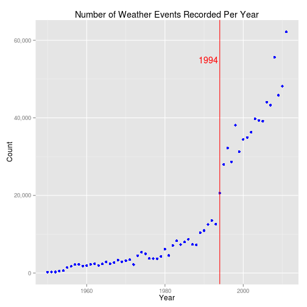
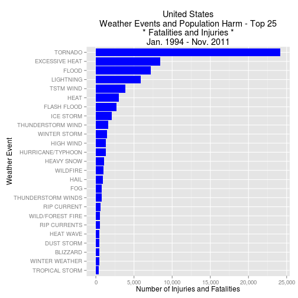
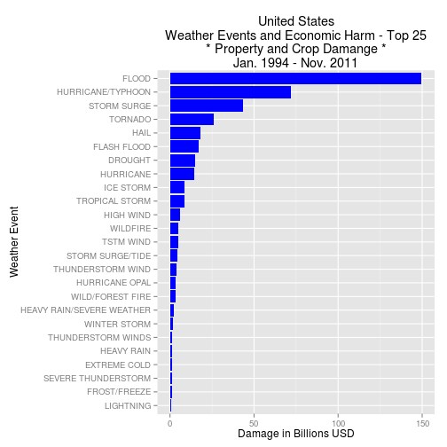

Analysis Of U.S. Weather Events
========================================================

Two questions to answer:

1. Across the United States, which types of events (as indicated in the EVTYPE variable) are most harmful with respect to population health?

2. Across the United States, which types of events have the greatest economic consequences?


```r
library(stringr)
library(data.table)
library(scales)
library(ggplot2)
```


```r
# read the data - read.csv can handle bz2 files. This is a long running
# opreation, we'll want to cache it.
raw.data <- read.csv(file = "repdata-data-StormData.csv.bz2", strip.white = TRUE)
```


```r
# copy of raw data so that we can refer back if we need to
data <- raw.data

# date type conversions
data$BGN_DATE <- as.Date(data$BGN_DATE, format = "%m/%d/%Y")
data$END_DATE <- as.Date(data$BGN_DATE, format = "%m/%d/%Y")

# states?
unique(data$STATE)
```

```
##  [1] AL AZ AR CA CO CT DE DC FL GA HI ID IL IN IA KS KY LA ME MD MA MI MN
## [24] MS MO MT NE NV NH NJ NM NY NC ND OH OK OR PA RI SC SD TN TX UT VT VA
## [47] WA WV WI WY PR AK ST AS GU MH VI AM LC PH GM PZ AN LH LM LE LS SL LO
## [70] PM PK XX
## 72 Levels: AK AL AM AN AR AS AZ CA CO CT DC DE FL GA GM GU HI IA ID ... XX
```

```r

# some of those are states, some appear to be territories, and some to be
# either fabricated on-the-fly or mistakes. I'm hesitant to change any for
# this analysis.  PZ? maybe that's for Panama Canal Zone which is now
# obsolete.  GM? maybe that's for Guam, which is GU?  LH? who knows?

# what does our weather event distribution look like?
DT <- data.table(data)
results <- DT[, length(BGN_DATE), by = as.numeric(format(BGN_DATE, "%Y"))]
setnames(results, c("Year", "Count"))

p <- ggplot(results, aes(x = Year, y = Count)) + geom_point(color = "blue") + 
    geom_vline(x = 1994, color = "red") + annotate("text", x = 1991, y = 55000, 
    label = "1994", color = "red") + ggtitle("Number of Weather Events Recorded Per Year") + 
    scale_y_continuous(labels = comma)
print(p)
```

 

```r

# Here are the valid event types from the docs
valid.event.types <- c("Astronomical Low Tide", "Avalanche", "Blizzard", "Coastal Flood", 
    "Cold/Wind Chill", "Debris Flow", "Dense Fog", "Dense Smoke", "Drought", 
    "Dust Devil", "Dust Storm", "Excessive Heat", "Extreme Cold/Wind Chill", 
    "Flash Flood", "Flood", "Frost/Freeze", "Funnel Cloud", "Freezing Fog", 
    "Hail", "Heat", "Heavy Rain", "Heavy Snow", "High Surf", "High Wind", "Hurricane (Typhoon)", 
    "Ice Storm", "Lake-Effect Snow", "Lakeshore Flood", "Lightning", "Marine Hail", 
    "Marine High Wind", "Marine Strong Wind", "Marine Thunderstorm Wind", "Rip Current", 
    "Seiche", "Sleet", "Storm Surge/Tide", "Strong Wind", "Thunderstorm Wind", 
    "Tornado", "Tropical Depression", "Tropical Storm", "Tsunami", "Volcanic Ash", 
    "Waterspout", "Wildfire", "Winter Storm", "Winter Weather")
valid.event.types <- toupper(valid.event.types)

# Excessive messiness. Those field guys need better data entry software so
# that a bunch of unnecessary hooey isn't flooding our data. (Ha, ha. Get
# it? 'flooding'???)

# Let's ease our data cleanup effort a bit. For now, we'll only look at
# events that have FATALITIES, INJURIES, PROPDMG, CROPDMG as those are the
# areas that we'll be focusing on in this analysis.
data <- subset(data, !is.na(FATALITIES) | !is.na(INJURIES) | !is.na(PROPDMG) | 
    !is.na(CROPDMG))

# uniformly upper case
data$EVTYPE2 <- toupper(str_trim(data$EVTYPE))

# start making substitutions. Note: order matters
data$EVTYPE2[grepl(".*AVAL.*", data$EVTYPE2)] <- "AVALANCHE"

data$EVTYPE2[grepl(".*T.*WIND.*", data$EVTYPE2)] <- "THUNDERSTORM WIND"

data$EVTYPE2[grepl("HIGH WIND.*", data$EVTYPE2)] <- "HIGH WIND"
data$EVTYPE2[grepl("WIND.*", data$EVTYPE2)] <- "HIGH WIND"
data$EVTYPE2[grepl(".*MICROBURST.*", data$EVTYPE2)] <- "HIGH WIND"
data$EVTYPE2[grepl(".*MICOBURST.*", data$EVTYPE2)] <- "HIGH WIND"
data$EVTYPE2[grepl("DOWNBURST.*", data$EVTYPE2)] <- "HIGH WIND"
data$EVTYPE2[grepl(".*WND.*", data$EVTYPE2)] <- "HIGH WIND"

data$EVTYPE2[grepl(".*TORN.*", data$EVTYPE2)] <- "TORNADO"
data$EVTYPE2[grepl(".*NADO.*", data$EVTYPE2)] <- "TORNADO"

data$EVTYPE2[grepl("FUN.*", data$EVTYPE2)] <- "FUNNEL CLOUD"
data$EVTYPE2[grepl(".*WALL.*", data$EVTYPE2)] <- "FUNNEL CLOUD"
data$EVTYPE2[grepl(".*SPOUT.*", data$EVTYPE2)] <- "WATERSPOUT"

data$EVTYPE2[grepl("HAIL.*", data$EVTYPE2)] <- "HAIL"

data$EVTYPE2[grepl(".*LIGHTN.*", data$EVTYPE2)] <- "LIGHTNING"
data$EVTYPE2[grepl(".*LIGHTI.*", data$EVTYPE2)] <- "LIGHTNING"
data$EVTYPE2[grepl(".*LIGNTN.*", data$EVTYPE2)] <- "LIGHTNING"

data$EVTYPE2[grepl(".*FLASH.*", data$EVTYPE2)] <- "FLASH FLOOD"
data$EVTYPE2[grepl(".*DAM.*", data$EVTYPE2)] <- "FLASH FLOOD"

data$EVTYPE2[grepl(".*FLOOD.*", data$EVTYPE2) & !grepl(".*FLASH.*", data$EVTYPE2)] <- "FLOOD"
data$EVTYPE2[grepl(".*URBAN.*SMALL.*", data$EVTYPE2)] <- "FLOOD"
data$EVTYPE2[grepl(".*URBAN.*SML.*", data$EVTYPE2)] <- "FLOOD"
data$EVTYPE2[grepl(".*SMALL.*STR.*", data$EVTYPE2)] <- "FLOOD"
data$EVTYPE2[grepl(".*RAPID.*RIS.*.*WAT.*", data$EVTYPE2)] <- "FLOOD"
data$EVTYPE2[grepl(".*SML.*STR.*", data$EVTYPE2)] <- "FLOOD"

data$EVTYPE2[grepl(".*HURR.*", data$EVTYPE2)] <- "HURRICANE (TYPHOON)"
data$EVTYPE2[grepl(".*TYPH.*", data$EVTYPE2)] <- "HURRICANE (TYPHOON)"
data$EVTYPE2[grepl(".*TROP.*STORM.*", data$EVTYPE2)] <- "TROPICAL STORM"

data$EVTYPE2[grepl(".*HEAVY.*RAIN.*", data$EVTYPE2)] <- "HEAVY RAIN"
data$EVTYPE2[grepl(".*HEAVY.*PREC.*", data$EVTYPE2)] <- "HEAVY RAIN"
data$EVTYPE2[grepl(".*REC.*RAIN.*", data$EVTYPE2)] <- "HEAVY RAIN"
data$EVTYPE2[grepl("RAIN", data$EVTYPE2)] <- "HEAVY RAIN"

data$EVTYPE2[grepl(".*THUNDER.*", data$EVTYPE2)] <- "THUNDERSTORM WIND"

data$EVTYPE2[grepl(".*EXTREME COLD.*", data$EVTYPE2)] <- "EXTREME COLD/WIND CHILL"
data$EVTYPE2[grepl(".*RECORD COLD.*", data$EVTYPE2)] <- "EXTREME COLD/WIND CHILL"
data$EVTYPE2[grepl(".*RECORD LOW.*", data$EVTYPE2)] <- "EXTREME COLD/WIND CHILL"
data$EVTYPE2[grepl(".*LOW TEMP.*", data$EVTYPE2)] <- "EXTREME COLD/WIND CHILL"

data$EVTYPE2[grepl(".*COLD*", data$EVTYPE2)] <- "COLD/WIND CHILL"

data$EVTYPE2[grepl(".*BLIZZ.*", data$EVTYPE2)] <- "BLIZZARD"
data$EVTYPE2[grepl("HEAVY SN*", data$EVTYPE2) & grepl(".*HIGH*", data$EVTYPE2)] <- "BLIZZARD"

data$EVTYPE2[grepl(".*FREEZING R.*", data$EVTYPE2)] <- "WINTER WEATHER"
data$EVTYPE2[grepl(".*SLEET.*", data$EVTYPE2)] <- "WINTER WEATHER"
data$EVTYPE2[grepl(".*SNOW.*", data$EVTYPE2)] <- "WINTER WEATHER"
data$EVTYPE2[grepl(".*WINT.*STOR.*", data$EVTYPE2)] <- "WINTER WEATHER"
data$EVTYPE2[grepl(".*WINT.*MIX.*", data$EVTYPE2)] <- "WINTER WEATHER"
data$EVTYPE2[grepl(".*FREEZ.*DRIZ.*", data$EVTYPE2)] <- "WINTER WEATHER"

data$EVTYPE2[grepl(".*ICE.*", data$EVTYPE2)] <- "ICE STORM"
data$EVTYPE2[grepl(".*GLAZ.*", data$EVTYPE2)] <- "ICE STORM"

data$EVTYPE2[grepl(".*FREEZE.*", data$EVTYPE2)] <- "FROST/FREEZE"
data$EVTYPE2[grepl(".*FROST.*", data$EVTYPE2)] <- "FROST/FREEZE"

data$EVTYPE2[grepl(".*RECORD HEAT.*", data$EVTYPE2)] <- "EXCESSIVE HEAT"
data$EVTYPE2[grepl(".*RECORD WARM.*", data$EVTYPE2)] <- "EXCESSIVE HEAT"
data$EVTYPE2[grepl(".*RECORD HIGH.*", data$EVTYPE2)] <- "EXCESSIVE HEAT"
data$EVTYPE2[grepl(".*HIGH TEMP.*", data$EVTYPE2)] <- "EXCESSIVE HEAT"

data$EVTYPE2[grepl(".*HEAT.*", data$EVTYPE2) & !grepl(".*RECORD H.*", data$EVTYPE2)] <- "HEAT"
data$EVTYPE2[grepl(".*WARM.*", data$EVTYPE2)] <- "HEAT"
data$EVTYPE2[grepl(".*HOT.*WEATH.*", data$EVTYPE2)] <- "HEAT"

data$EVTYPE2[grepl(".*HIGH.*TIDE.*", data$EVTYPE2)] <- "STORM SURGE/TIDE"
data$EVTYPE2[grepl(".*STORM.*SURG.*", data$EVTYPE2)] <- "STORM SURGE/TIDE"
data$EVTYPE2[grepl(".*COAST.*SURG.*", data$EVTYPE2)] <- "STORM SURGE/TIDE"

data$EVTYPE2[grepl(".*HIGH.*SEA.*", data$EVTYPE2)] <- "HIGH SURF"
data$EVTYPE2[grepl(".*HIGH.*WAV.*", data$EVTYPE2)] <- "HIGH SURF"
data$EVTYPE2[grepl(".*HEAV.*SEA.*", data$EVTYPE2)] <- "HIGH SURF"
data$EVTYPE2[grepl(".*HEAV.*SURF.*", data$EVTYPE2)] <- "HIGH SURF"
data$EVTYPE2[grepl(".*HAZ.*SURF.*", data$EVTYPE2)] <- "HIGH SURF"

data$EVTYPE2[grepl(".*DUST.*", data$EVTYPE2)] <- "DUST STORM"
data$EVTYPE2[grepl(".*BLOW.*DUST.*", data$EVTYPE2)] <- "DUST STORM"

data$EVTYPE2[grepl(".*FIRE.*", data$EVTYPE2)] <- "WILDFIRE"

data$EVTYPE2[grepl(".*VOLC.*", data$EVTYPE2)] <- "VOLCANIC ASH"

# Report on what's left that doesn't fit
x <- unique(data$EVTYPE2[!(data$EVTYPE2 %in% valid.event.types)])
length(x)
```

```
## [1] 167
```

```r
x
```

```
##   [1] "MARINE MISHAP"              "SEVERE TURBULENCE"         
##   [3] "APACHE COUNTY"              "HIGH"                      
##   [5] "MUDSLIDES"                  "UNSEASONABLY DRY"          
##   [7] "UNSEASONABLY WET"           "NORMAL PRECIPITATION"      
##   [9] "DRY"                        "MUD SLIDE"                 
##  [11] "COOL AND WET"               "MUD SLIDES"                
##  [13] "EXCESSIVE WETNESS"          "FOG"                       
##  [15] "BELOW NORMAL PRECIPITATION" "RECORD TEMPERATURES"       
##  [17] "OTHER"                      "MUDSLIDE"                  
##  [19] "ICY ROADS"                  "HEAVY MIX"                 
##  [21] "RIP CURRENTS"               "SOUTHEAST"                 
##  [23] "HIGH WATER"                 "WET WEATHER"               
##  [25] "BEACH EROSIN"               "HYPOTHERMIA"               
##  [27] "MUD/ROCK SLIDE"             "TSTMW"                     
##  [29] "LANDSLIDE"                  "EXCESSIVE"                 
##  [31] "?"                          "HOT PATTERN"               
##  [33] "EXCESSIVE PRECIPITATION"    "HOT/DRY PATTERN"           
##  [35] "DRY PATTERN"                "MILD/DRY PATTERN"          
##  [37] "MILD PATTERN"               "LANDSLIDES"                
##  [39] "HEAVY SHOWERS"              "HEAVY SHOWER"              
##  [41] "HEAVY SWELLS"               "RECORD DRY MONTH"          
##  [43] "TEMPERATURE RECORD"         "ROUGH SURF"                
##  [45] "MARINE ACCIDENT"            "COASTAL STORM"             
##  [47] "WET MONTH"                  "WET YEAR"                  
##  [49] "BEACH EROSION"              "HOT AND DRY"               
##  [51] "LANDSLUMP"                  "RECORD TEMPERATURE"        
##  [53] "MIXED PRECIP"               "FREEZING SPRAY"            
##  [55] "SUMMARY JAN 17"             "SUMMARY OF MARCH 14"       
##  [57] "SUMMARY OF MARCH 23"        "SUMMARY OF MARCH 24"       
##  [59] "SUMMARY OF APRIL 3RD"       "SUMMARY OF APRIL 12"       
##  [61] "SUMMARY OF APRIL 13"        "SUMMARY OF APRIL 21"       
##  [63] "SUMMARY AUGUST 11"          "SUMMARY OF APRIL 27"       
##  [65] "SUMMARY OF MAY 9-10"        "SUMMARY OF MAY 10"         
##  [67] "SUMMARY OF MAY 13"          "SUMMARY OF MAY 14"         
##  [69] "SUMMARY OF MAY 22 AM"       "SUMMARY OF MAY 22 PM"      
##  [71] "SUMMARY OF MAY 26 AM"       "SUMMARY OF MAY 26 PM"      
##  [73] "METRO STORM, MAY 26"        "SUMMARY OF MAY 31 AM"      
##  [75] "SUMMARY OF MAY 31 PM"       "SUMMARY OF JUNE 3"         
##  [77] "SUMMARY OF JUNE 4"          "SUMMARY JUNE 5-6"          
##  [79] "SUMMARY JUNE 6"             "SUMMARY OF JUNE 11"        
##  [81] "SUMMARY OF JUNE 12"         "SUMMARY OF JUNE 13"        
##  [83] "SUMMARY OF JUNE 15"         "SUMMARY OF JUNE 16"        
##  [85] "SUMMARY JUNE 18-19"         "SUMMARY OF JUNE 23"        
##  [87] "SUMMARY OF JUNE 24"         "SUMMARY OF JUNE 30"        
##  [89] "SUMMARY OF JULY 2"          "SUMMARY OF JULY 3"         
##  [91] "SUMMARY OF JULY 11"         "SUMMARY OF JULY 22"        
##  [93] "SUMMARY JULY 23-24"         "SUMMARY OF JULY 26"        
##  [95] "SUMMARY OF JULY 29"         "SUMMARY OF AUGUST 1"       
##  [97] "SUMMARY AUGUST 2-3"         "SUMMARY AUGUST 7"          
##  [99] "SUMMARY AUGUST 9"           "SUMMARY AUGUST 10"         
## [101] "SUMMARY AUGUST 17"          "SUMMARY AUGUST 21"         
## [103] "SUMMARY AUGUST 28"          "SUMMARY SEPTEMBER 4"       
## [105] "SUMMARY SEPTEMBER 20"       "SUMMARY SEPTEMBER 23"      
## [107] "SUMMARY SEPT. 25-26"        "SUMMARY: OCT. 20-21"       
## [109] "SUMMARY: OCTOBER 31"        "SUMMARY: NOV. 6-7"         
## [111] "SUMMARY: NOV. 16"           "NO SEVERE WEATHER"         
## [113] "SUMMARY OF MAY 22"          "SUMMARY OF JUNE 6"         
## [115] "SUMMARY AUGUST 4"           "SUMMARY OF JUNE 10"        
## [117] "SUMMARY OF JUNE 18"         "SUMMARY SEPTEMBER 3"       
## [119] "SUMMARY: SEPT. 18"          "MUDSLIDE/LANDSLIDE"        
## [121] "NONE"                       "BLOW-OUT TIDES"            
## [123] "UNSEASONABLY COOL"          "BLOW-OUT TIDE"             
## [125] "HYPOTHERMIA/EXPOSURE"       "MIXED PRECIPITATION"       
## [127] "COASTALSTORM"               "SUMMARY OF MARCH 24-25"    
## [129] "SUMMARY OF MARCH 27"        "SUMMARY OF MARCH 29"       
## [131] "MILD AND DRY PATTERN"       "HIGH SWELLS"               
## [133] "HIGH  SWELLS"               "DRY SPELL"                 
## [135] "HOT SPELL"                  "UNSEASONABLY HOT"          
## [137] "DRY WEATHER"                "COASTAL EROSION"           
## [139] "TSTM"                       "HYPERTHERMIA/EXPOSURE"     
## [141] "ROCK SLIDE"                 "PATCHY DENSE FOG"          
## [143] "RECORD COOL"                "COOL SPELL"                
## [145] "EXCESSIVELY DRY"            "VOG"                       
## [147] "MONTHLY PRECIPITATION"      "MONTHLY TEMPERATURE"       
## [149] "RECORD DRYNESS"             "DRY CONDITIONS"            
## [151] "REMNANTS OF FLOYD"          "DRIEST MONTH"              
## [153] "DRYNESS"                    "RECORD PRECIPITATION"      
## [155] "ROUGH SEAS"                 "UNSEASONABLY COOL & WET"   
## [157] "HIGH SURF ADVISORY"         "ABNORMALLY DRY"            
## [159] "RED FLAG CRITERIA"          "SMOKE"                     
## [161] "EXTREMELY WET"              "VERY DRY"                  
## [163] "ROGUE WAVE"                 "NORTHERN LIGHTS"           
## [165] "ABNORMALLY WET"             "DROWNING"                  
## [167] "HIGH SURF ADVISORIES"
```

```r

# Collect the remaining ones into 'OTHER'
data$EVTYPE2[!(data$EVTYPE2 %in% valid.event.types)] <- "OTHER"
```


```r
# Generate a plot to answer Across the United States, which types of events
# (as indicated in the EVTYPE variable) are most harmful with respect to
# population health?

# 1994 is when data reporting picked up, start with data from then onward.
DT <- data.table(subset(data, data$BGN_DATE >= "1994-01-01"))

# aggregate harm to people by event type. Get top 25.
results <- DT[, sum(FATALITIES + INJURIES), by = EVTYPE]
results <- results[order(V1, na.last = TRUE, decreasing = TRUE), ]
top25 <- head(results, 25)

# Plot them.
p <- ggplot(top25, aes(x = reorder(EVTYPE, V1), y = V1)) + geom_bar(stat = "identity", 
    fill = "blue") + coord_flip() + scale_y_continuous(labels = comma) + ggtitle("United States\nWeather Events and Population Harm - Top 25\n* Fatalities and Injuries *\nJan. 1994 - Nov. 2011") + 
    xlab("Weather Event") + ylab("Number of Injuries and Fatalities")
print(p)
```

 

```r

# Numbers for the Top 2?
x <- head(top25, 2)
x$V1 <- format(x$V1, big.mark = ",", scientific = F)
setnames(x, c("Event", "Fatalities and Injuries"))
x
```

```
##             Event Fatalities and Injuries
## 1:        TORNADO                  24,164
## 2: EXCESSIVE HEAT                   8,428
```


```r
# Generate a plot to answer: Across the United States, which types of events
# have the greatest economic consequences?

# For economic impact, we care about: PROPDMG PROPDMGEXP CROPDMG CROPDMGEXP
# EXP: “K” for thousands, “M” for millions, and “B” for billions

# > unique(data$CROPDMGEXP) [1] M K m B ? 0 k 2 Levels: 0 2 ? B K M k m >
# unique(data$PROPDMGEXP) [1] K M B m + 0 5 6 ? 4 2 3 h 7 H - 1 8 Levels: +
# - 0 1 2 3 4 5 6 7 8 ? B H K M h m

# We need a vectorized function to translate the 'EXP' character into a
# multiplier value.
get.multiplier <- function(ch) {
    return(switch(EXPR = ch, K = 1000, M = 1e+06, B = 1e+09, 1))
}
v.get.multiplier <- Vectorize(get.multiplier)

# some cleanup for sanity
data$PROPDMGEXP <- toupper(str_trim(data$PROPDMGEXP))
data$CROPDMGEXP <- toupper(str_trim(data$CROPDMGEXP))

# calc the amount
data$PROPDMG_CALC <- data$PROPDMG * v.get.multiplier(data$PROPDMGEXP)
data$CROPDMG_CALC <- data$CROPDMG * v.get.multiplier(data$CROPDMGEXP)

# 1994 is when data reporting picked up, start with data from then onward.
DT <- data.table(subset(data, data$BGN_DATE >= "1994-01-01"))

# aggregate damage by event type and get the top 25
results <- DT[, sum(PROPDMG_CALC + CROPDMG_CALC), by = EVTYPE]
results <- results[order(V1, na.last = TRUE, decreasing = TRUE), ]
top25 <- head(results, 25)

# now plot it (show damage in terms of billions of dollars)
p <- ggplot(top25, aes(x = reorder(EVTYPE, V1), y = V1/1e+09)) + geom_bar(stat = "identity", 
    fill = "blue") + coord_flip() + scale_y_continuous(labels = comma) + ggtitle("United States\nWeather Events and Economic Harm - Top 25\n* Property and Crop Damange *\nJan. 1994 - Nov. 2011") + 
    xlab("Weather Event") + ylab("Damage in Billions USD")
print(p)
```

 

```r

# Numbers for the Top 2?
x <- head(top25, 2)
x$V1 <- format(x$V1/1e+09, big.mark = ",", scientific = F)
setnames(x, c("Event", "Damage - Billions"))
x
```

```
##                Event Damage - Billions
## 1:             FLOOD            149.69
## 2: HURRICANE/TYPHOON             71.91
```

